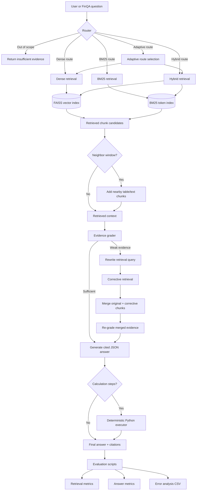

# FinRag

FinRag is an evaluated Retrieval-Augmented Generation system for financial question answering on
[FinQA](https://github.com/czyssrs/FinQA). The project retrieves evidence from financial report
tables and text, generates cited answers with Mistral models, and evaluates where the pipeline fails:
retrieval, evidence sufficiency, citation validity, abstention, or numerical reasoning.

The current system is intentionally experimental. The goal is not only to produce answers, but to make
each stage measurable enough that improvements can be tested instead of guessed.

## What This Project Does

- Loads FinQA examples from `data/FinQA/dataset/dev.json`.
- Converts each example into structure-aware chunks:
  - one chunk per table row;
  - one chunk per pre-text paragraph;
  - one chunk per post-text paragraph.
- Embeds chunk content with Mistral embeddings.
- Stores vectors in a FAISS index.
- Supports dense, BM25, hybrid, and adaptive retrieval.
- Optionally expands retrieved chunks with neighboring rows/paragraphs.
- Grades whether retrieved evidence appears sufficient.
- Performs corrective retrieval using query rewriting, hybrid retrieval, larger `top_k`, and neighbors.
- Generates JSON answers with citations.
- For numerical questions, asks the LLM for structured calculation steps and executes them deterministically in Python.
- Evaluates retrieval and answer quality with CSV outputs for failure analysis.

## Architecture



## Repository Layout

```text
.
├── data/
│   ├── FinQA/                    # FinQA dataset and original reference code
│   ├── chunks.json               # Generated chunks
│   ├── index.faiss               # FAISS vector index
│   └── index_metadata.json       # Embedding/index metadata
├── evaluation/
│   ├── evaluate_answers.py       # End-to-end answer evaluation
│   ├── evaluate_evidence_grader.py
│   ├── evaluate_retrieval.py
│   └── error_analysis.py
├── results/                      # Evaluation CSV outputs
├── src/
│   ├── calculation.py            # Deterministic arithmetic execution
│   ├── chunk.py                  # Structure-aware FinQA chunking
│   ├── embed.py                  # Mistral embeddings + FAISS index building
│   ├── generate.py               # Retrieval + generation pipeline
│   ├── grade_documents.py        # Evidence sufficiency grading
│   ├── load_data.py              # FinQA loading/parsing
│   ├── query_rewrite.py          # LLM/heuristic query rewriting
│   ├── retrieve.py               # Dense, BM25, hybrid, adaptive retrieval
│   ├── router.py                 # Adaptive retrieval router
│   └── schemas.py                # Shared data models
└── README.md
```

## Setup

Create and activate a virtual environment:

```bash
python -m venv .venv
source .venv/bin/activate
pip install -r requirements.txt
```

Create a `.env` file:

```bash
MISTRAL_API_KEY=your_key_here
```

Do not commit `.env`. The API key is used for Mistral embeddings, query rewriting, and answer
generation.

## Data

Place or clone FinQA under:

```text
data/FinQA
```

The default dataset path used by the project is:

```text
data/FinQA/dataset/dev.json
```

The current index was built on a limited dev subset. If you evaluate more examples than were indexed,
the missing examples cannot be retrieved. Rebuild the chunks and index when changing the dataset split
or limit.

## Build Chunks And Embeddings

Build chunks and a FAISS index:

```bash
.venv/bin/python src/embed.py --limit 100 --rebuild-chunks
```

Useful options:

```bash
.venv/bin/python src/embed.py \
  --dataset-path data/FinQA/dataset/dev.json \
  --chunks-path data/chunks.json \
  --index-path data/index.faiss \
  --metadata-path data/index_metadata.json \
  --limit 100 \
  --batch-size 32 \
  --metric cosine \
  --rebuild-chunks
```

The embedding index stores one vector per chunk. The vector at FAISS row `i` corresponds to chunk
`chunks[i]` from `data/chunks.json`, and metadata is kept in `data/index_metadata.json`.

## Run Retrieval

Dense retrieval:

```bash
.venv/bin/python src/retrieve.py \
  --query "what is the average payment volume per transaction for american express?" \
  --method dense \
  --top-k 5
```

Show the adaptive route decision:

```bash
.venv/bin/python src/retrieve.py \
  --query "what was the percentage cumulative total return for citi common stock?" \
  --method adaptive \
  --show-route
```

Run an example-scoped diagnostic retrieval:

```bash
.venv/bin/python src/retrieve.py \
  --query "what is the average payment volume per transaction for american express?" \
  --method dense \
  --top-k 10 \
  --allowed-example-id V/2008/page_17.pdf-1
```

Example-scoped retrieval is a diagnostic control, not a production feature. It answers the question:
"If the correct FinQA example/document had already been selected, can the evidence retriever find the
right chunks?"

## Retrieval Modes

`dense`
: Embeds the query with Mistral and searches FAISS using cosine similarity.

`bm25`
: Uses lexical matching over tokenized chunk text.

`hybrid`
: Combines dense and BM25 rankings using Reciprocal Rank Fusion.

`adaptive`
: Routes the question based on simple signals:
  - numeric/table questions use dense retrieval with a neighbor window;
  - exact term/date/ticker-like questions use hybrid retrieval;
  - out-of-scope questions abstain;
  - otherwise, dense retrieval is used.

## Corrective Retrieval

When evidence grading is enabled and the grader marks retrieved evidence as weak, the pipeline can
retry retrieval with:

- an LLM-rewritten query;
- hybrid retrieval;
- larger candidate depth;
- `neighbor_window=1`.

The corrective result is merged with the original retrieved context. This is important: corrective
retrieval should add missing evidence without throwing away useful evidence that was already found.

## Generate Answers

Run the end-to-end RAG pipeline:

```bash
.venv/bin/python src/generate.py \
  --query "what is the average payment volume per transaction for american express?" \
  --method dense \
  --top-k 10 \
  --show-route \
  --show-evidence
```

Use adaptive retrieval plus evidence grading:

```bash
.venv/bin/python src/generate.py \
  --query "what was the percentage cumulative total return for citi common stock?" \
  --method adaptive \
  --use-evidence-grader \
  --show-grade
```

Generated answers are JSON internally and include:

- `answer`
- `citations`
- `calculation`
- `calculation_steps`
- `answer_unit`
- `answer_scale`
- `insufficient_evidence`

## Structured Calculation

For numerical questions, the LLM is asked to output executable calculation steps:

```json
[
  {"operation": "subtract", "arguments": [1654, 1251]},
  {"operation": "add", "arguments": [1654, "#0"]}
]
```

Python then executes the steps deterministically in `src/calculation.py`. This reduces arithmetic
errors from the LLM and makes failures easier to inspect.

Supported operations:

- `add`
- `subtract`
- `multiply`
- `divide`
- `exp`
- `greater`

Supported display units/scales include:

- `raw`
- `percent`
- `percentage_points`
- `million`
- `billion`
- `dollars`
- `shares`
- `auto`
- `ratio_to_percent`

The executor fixes arithmetic, but it cannot fix a bad program choice. If the LLM selects the wrong
operands, the executed answer will still be wrong.

## Evaluation

### Retrieval Evaluation

Global retrieval:

```bash
.venv/bin/python evaluation/evaluate_retrieval.py \
  --method dense \
  --limit 100 \
  --max-k 10 \
  --scope global
```

Example-scoped diagnostic retrieval:

```bash
.venv/bin/python evaluation/evaluate_retrieval.py \
  --method dense \
  --limit 100 \
  --max-k 10 \
  --scope example
```

Retrieval evaluation uses strict evidence IDs:

```text
example_id::table_3
example_id::text_12
```

This avoids accidentally counting `table_3` from the wrong financial report as correct.

Metrics:

- `mrr`: mean reciprocal rank of the first gold evidence hit.
- `hit_rate@k`: percentage of questions with at least one gold evidence chunk in the top `k`.
- `recall@k`: average fraction of gold evidence chunks retrieved in the top `k`.

### Answer Evaluation

Global end-to-end evaluation:

```bash
.venv/bin/python evaluation/evaluate_answers.py \
  --method dense \
  --limit 20 \
  --top-k 10 \
  --scope global \
  --predictions-path results/dense_global_answers.csv
```

Example-scoped diagnostic evaluation:

```bash
.venv/bin/python evaluation/evaluate_answers.py \
  --method dense \
  --limit 20 \
  --top-k 10 \
  --scope example \
  --predictions-path results/dense_example_structured_calculation_answers.csv
```

Metrics:

- `exact_match`: strict normalized string match.
- `numerical_match`: numeric match against the gold answer or FinQA `exe_ans`.
- `citation_validity`: whether citations point to retrieved chunks.
- `execution_success_rate`: percentage of answers where structured calculation executed.
- `execution_error_rate`: percentage of answers where calculation execution failed.
- `insufficient_evidence_rate`: percentage of answers where the model abstained.
- `error_rate`: pipeline failures.

For this project, `numerical_match` is usually more informative than `exact_match`, because FinQA gold
answers often omit units such as `million`, `shares`, or `$`.

### Evidence Grader Evaluation

```bash
.venv/bin/python evaluation/evaluate_evidence_grader.py \
  --method dense \
  --limit 100 \
  --top-k 10 \
  --scope global \
  --results-path results/evidence_grader_global.csv
```

The grader is heuristic. It checks signals such as metric overlap, year support, numeric support,
table support, and document cohesion. It now grades evidence using the dominant retrieved example so
mixed-document context does not look stronger than it really is.

### Error Analysis

```bash
.venv/bin/python evaluation/error_analysis.py \
  --predictions-path results/dense_example_structured_calculation_answers.csv \
  --output-path results/error_analysis.csv \
  --limit 20
```

Error categories include:

- `correct`
- `retrieval_failure`
- `partial_retrieval`
- `over_abstention`
- `citation_issue`
- `calculation_or_generation_error`
- `pipeline_error`

## Current Findings

Recent smoke tests showed:

```text
dense retrieval, limit 10, top_k 10
global recall@10:  0.8167
example recall@10: 0.9500
```

This suggests the system retrieves evidence much better once it is searching inside the correct
FinQA example. In other words, global document/example selection is a real bottleneck.

Recent answer evaluation with example-scoped dense retrieval showed:

```text
before structured calculation:
numerical_match: 0.5000
insufficient_evidence_rate: 0.3000
error_rate: 0.0000

after structured calculation:
numerical_match: 0.5500
insufficient_evidence_rate: 0.2000
execution_success_rate: 0.7000
error_rate: 0.0000
```

This suggests deterministic execution helps, but the model still sometimes chooses the wrong operands
or operation. The next major gains should come from better evidence selection and program generation,
not just more retrieval volume.

## Development Notes

- Keep retrieval and generation evaluation separate. If answer quality is poor, first check whether
  the gold evidence was retrieved.
- Use `--scope example` only as a diagnostic baseline. It uses gold example IDs and should not be
  treated as a production score.
- Use distinct prediction paths for each experiment so results do not overwrite each other.
- Rebuild chunks and embeddings when changing dataset split or index size.
- Avoid trusting `exact_match` alone for financial answers because unit formatting often differs.
- Prefer small, repeatable experiments before running larger expensive evaluations.

## Recommended Next Improvements

1. Add a document/page selection stage before chunk retrieval.
2. Add a reranker over 20-30 retrieved candidates, then pass only 5-8 high-quality chunks to generation.
3. Improve program generation by validating that operands appear in cited chunks.
4. Add support for FinQA table aggregate programs such as `table_average`, `table_sum`, `table_min`,
   and `table_max`.
5. Calibrate the evidence grader against strict gold evidence labels.
6. Evaluate on larger indexed subsets after rebuilding the full required index.
