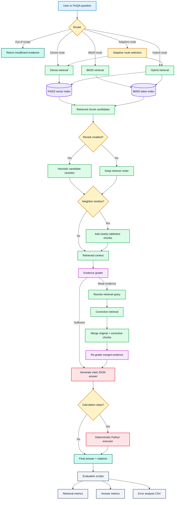

# FinRag

FinRag is an evaluated Retrieval-Augmented Generation system for financial question answering on
[FinQA](https://github.com/czyssrs/FinQA). It retrieves evidence from financial report tables and
text, generates cited answers with Mistral models, executes numerical calculations deterministically,
and measures where the pipeline fails: retrieval, evidence sufficiency, citation validity, abstention,
or numerical reasoning.

The primary benchmark follows FinQA's intended setting: a question is paired with its financial
report, and the retriever must find the supporting facts inside that report. FinRag also includes a
separate open-corpus stress test that searches all 883 development-set reports; those results are
reported separately because FinQA questions often assume that the report is already known.

## Project At A Glance

FinRag is a small but complete RAG system for answering financial questions that require evidence
retrieval, table understanding, citations, and numerical reasoning.

- **Real dataset:** FinQA financial report questions with tables, paragraphs, gold evidence, and gold answers.
- **Full RAG pipeline:** structure-aware chunking, FAISS dense retrieval, BM25, hybrid retrieval,
  adaptive routing, reranking, corrective retrieval, cited generation, and deterministic calculation execution.
- **Evaluation built in:** retrieval recall, answer accuracy, citation validity, abstention rate,
  execution success, error analysis, and experiment CSVs.
- **Measurable iteration:** the project follows a clear loop:
  `measure -> diagnose -> modify retrieval/generation -> remeasure`.
- **Usable interface:** a Streamlit app lets you ask a financial question and inspect the answer,
  citations, retrieved evidence, route decision, evidence grade, calculation trace, and latency/cost trace.
- **Comparable primary benchmark:** full-development-set report-scoped retrieval follows FinQA's
  standard task definition.
- **Harder extension:** open-corpus retrieval measures document discovery and evidence retrieval
  jointly across all 883 reports.

Primary full-dev retrieval result:

```text
BM25 + heuristic reranking, report-scoped, 883 examples
MRR:        0.7160
Hit@5:      0.9309
Recall@5:   0.8397
Hit@10:     0.9796
Recall@10:  0.9342
```

Open-corpus stress-test result:

```text
Adaptive + heuristic reranking, global, 883 examples
MRR:        0.3410
Hit@5:      0.6014
Recall@5:   0.4642
Hit@10:     0.7225
Recall@10:  0.5914
```

These two settings are not directly comparable: report-scoped retrieval answers the FinQA benchmark
question, while global retrieval additionally has to infer which report the question refers to.

## What This Project Does

- Loads FinQA examples from `data/FinQA/dataset/dev.json`.
- Converts each example into structure-aware chunks:
  - one chunk per table row;
  - one chunk per pre-text paragraph;
  - one chunk per post-text paragraph.
- Embeds chunk content with Mistral embeddings.
- Stores vectors in a FAISS index.
- Supports dense, BM25, hybrid, and adaptive retrieval.
- Can rerank larger candidate sets with a lightweight heuristic reranker.
- Optionally expands retrieved chunks with neighboring rows/paragraphs.
- Grades whether retrieved evidence appears sufficient.
- Performs corrective retrieval using query rewriting, hybrid retrieval, larger `top_k`, and neighbors.
- Generates JSON answers with citations.
- For numerical questions, asks the LLM for structured calculation steps and executes them deterministically in Python.
- Tracks latency, model calls, token usage, and optional estimated generation cost.
- Evaluates retrieval and answer quality with CSV outputs for failure analysis.

## Architecture



## Repository Layout

```text
.
├── data/
│   ├── FinQA/                    # FinQA dataset and original reference code
│   ├── chunks.json               # Generated chunks
│   ├── index.faiss               # FAISS vector index
│   └── index_metadata.json       # Embedding/index metadata
├── evaluation/
│   ├── evaluate_answers.py       # End-to-end answer evaluation
│   ├── evaluate_evidence_grader.py
│   ├── evaluate_retrieval.py
│   ├── error_analysis.py
│   └── run_global_experiment.py  # Reproducible multi-method experiment runner
├── results/                      # Evaluation CSV outputs
├── src/
│   ├── calculation.py            # Deterministic arithmetic execution
│   ├── chunk.py                  # Structure-aware FinQA chunking
│   ├── embed.py                  # Mistral embeddings + FAISS index building
│   ├── generate.py               # Retrieval + generation pipeline
│   ├── grade_documents.py        # Evidence sufficiency grading
│   ├── load_data.py              # FinQA loading/parsing
│   ├── query_rewrite.py          # LLM/heuristic query rewriting
│   ├── rerank.py                 # Lightweight candidate reranking
│   ├── retrieve.py               # Dense, BM25, hybrid, adaptive retrieval
│   ├── router.py                 # Adaptive retrieval router
│   └── schemas.py                # Shared data models
├── tests/
│   └── test_retrieval_routing.py # Neighbor-order and adaptive-candidate regressions
├── app.py                        # Streamlit interface
└── README.md
```

## Setup

Create and activate a virtual environment:

```bash
python -m venv .venv
source .venv/bin/activate
pip install -r requirements.txt
```

Create a `.env` file:

```bash
MISTRAL_API_KEY=your_key_here
```

Do not commit `.env`. The API key is used for Mistral embeddings, query rewriting, and answer
generation.

## Data

Place or clone FinQA under:

```text
data/FinQA
```

The default dataset path used by the project is:

```text
data/FinQA/dataset/dev.json
```

The index must cover every example used by an evaluation. Rebuild the chunks and index whenever the
dataset split or indexed limit changes.

## Build Chunks And Embeddings

Build chunks and a FAISS index:

```bash
.venv/bin/python src/embed.py --limit 100 --rebuild-chunks
```

Useful options:

```bash
.venv/bin/python src/embed.py \
  --dataset-path data/FinQA/dataset/dev.json \
  --chunks-path data/chunks.json \
  --index-path data/index.faiss \
  --metadata-path data/index_metadata.json \
  --limit 100 \
  --batch-size 32 \
  --metric cosine \
  --rebuild-chunks
```

The embedding index stores one vector per chunk. The vector at FAISS row `i` corresponds to chunk
`chunks[i]` from `data/chunks.json`, and metadata is kept in `data/index_metadata.json`.

## Latency And Cost Instrumentation

The pipeline records a `PipelineTrace` for each generated answer. It tracks:

- latency per stage: artifact loading, retrieval, evidence grading, query rewriting, corrective
  retrieval, generation, calculation execution, and total runtime;
- embedding, generation, and rewrite call counts;
- input, output, and total tokens when the Mistral response exposes usage metadata;
- retrieved chunk count;
- whether reranking, evidence grading, corrective retry, and adaptive routing were used;
- optional estimated generation cost.

Cost estimates are intentionally not hardcoded because model pricing changes. To enable estimates,
put current prices in your `.env` file:

```bash
MISTRAL_INPUT_COST_PER_1M_TOKENS=...
MISTRAL_OUTPUT_COST_PER_1M_TOKENS=...
```

Inspect a single trace from the CLI:

```bash
.venv/bin/python src/generate.py \
  --query "what is the average payment volume per transaction for american express?" \
  --method dense \
  --top-k 10 \
  --candidate-k 30 \
  --rerank \
  --show-trace
```

Answer evaluation CSVs also include trace columns such as `total_ms`, `retrieval_ms`,
`generation_ms`, `embedding_calls`, `generation_calls`, `input_tokens`, `output_tokens`,
`estimated_cost_usd`, `used_rerank`, `used_evidence_grader`, and `used_corrective_retry`.

This makes it possible to discuss quality-vs-latency tradeoffs concretely. For example, reranking or
corrective retrieval may improve answer quality, but the trace shows whether the gain came with extra
retrieval time, extra LLM calls, or higher token cost.

## Run Retrieval

Dense retrieval:

```bash
.venv/bin/python src/retrieve.py \
  --query "what is the average payment volume per transaction for american express?" \
  --method dense \
  --top-k 5 \
  --rerank \
  --candidate-k 30
```

Show the adaptive route decision:

```bash
.venv/bin/python src/retrieve.py \
  --query "what was the percentage cumulative total return for citi common stock?" \
  --method adaptive \
  --show-route
```

Run report-scoped retrieval for a known FinQA report:

```bash
.venv/bin/python src/retrieve.py \
  --query "what is the average payment volume per transaction for american express?" \
  --method dense \
  --top-k 10 \
  --allowed-example-id V/2008/page_17.pdf-1
```

In FinQA, the question is paired with its report. `--allowed-example-id` applies that standard
report scope to an individual query; it does not reveal the gold evidence rows.

## Retrieval Modes

`dense`
: Embeds the query with Mistral and searches FAISS using cosine similarity.

`bm25`
: Uses lexical matching over tokenized chunk text.

`hybrid`
: Combines dense and BM25 rankings using Reciprocal Rank Fusion.

`adaptive`
: Routes the question based on simple signals:
  - numeric/table questions use dense retrieval with a neighbor window;
  - exact term/date/ticker-like questions use hybrid retrieval;
  - out-of-scope questions abstain;
  - otherwise, dense retrieval is used.

`--rerank`
: Retrieves a larger candidate set, scores candidates with lightweight features, then keeps the best
  `top_k`. The reranker considers original rank, retrieval score, question/content term overlap,
  year support, number support, table relevance, and document/example cohesion. It is intentionally
  local and cheap: no extra LLM calls are required.

## Corrective Retrieval

When evidence grading is enabled and the grader marks retrieved evidence as weak, the pipeline can
retry retrieval with:

- an LLM-rewritten query;
- hybrid retrieval;
- larger candidate depth;
- `neighbor_window=1`.

The corrective result is merged with the original retrieved context. This is important: corrective
retrieval should add missing evidence without throwing away useful evidence that was already found.

## Generate Answers

Run the end-to-end RAG pipeline:

```bash
.venv/bin/python src/generate.py \
  --query "what is the average payment volume per transaction for american express?" \
  --method dense \
  --top-k 10 \
  --candidate-k 30 \
  --rerank \
  --show-route \
  --show-evidence
```

Use adaptive retrieval plus evidence grading:

```bash
.venv/bin/python src/generate.py \
  --query "what was the percentage cumulative total return for citi common stock?" \
  --method adaptive \
  --use-evidence-grader \
  --rerank \
  --show-grade
```

Generated answers are JSON internally and include:

- `answer`
- `citations`
- `calculation`
- `calculation_steps`
- `answer_unit`
- `answer_scale`
- `insufficient_evidence`

## Structured Calculation

For numerical questions, the LLM is asked to output executable calculation steps:

```json
[
  {"operation": "subtract", "arguments": [1654, 1251]},
  {"operation": "add", "arguments": [1654, "#0"]}
]
```

Python then executes the steps deterministically in `src/calculation.py`. This reduces arithmetic
errors from the LLM and makes failures easier to inspect.

Supported operations:

- `add`
- `subtract`
- `multiply`
- `divide`
- `exp`
- `greater`

Supported display units/scales include:

- `raw`
- `percent`
- `percentage_points`
- `million`
- `billion`
- `dollars`
- `shares`
- `auto`
- `ratio_to_percent`

The executor fixes arithmetic, but it cannot fix a bad program choice. If the LLM selects the wrong
operands, the executed answer will still be wrong.

## Evaluation

Evaluation commands default to `--scope example`, the report-scoped FinQA setting. Pass
`--scope global` explicitly for the open-corpus extension.

### Retrieval Evaluation

Report-scoped retrieval is the primary FinQA benchmark:

```bash
.venv/bin/python evaluation/evaluate_retrieval.py \
  --dataset-path data/FinQA/dataset/dev.json \
  --method bm25 \
  --limit 883 \
  --max-k 10 \
  --candidate-k 30 \
  --rerank \
  --scope example \
  --failures-path results/bm25_scoped_reranked_failures.csv
```

Open-corpus retrieval is an additional stress test across all indexed reports:

```bash
.venv/bin/python evaluation/evaluate_retrieval.py \
  --dataset-path data/FinQA/dataset/dev.json \
  --method adaptive \
  --limit 883 \
  --max-k 10 \
  --candidate-k 30 \
  --rerank \
  --scope global \
  --failures-path results/adaptive_global_reranked_fixed_failures.csv
```

Retrieval evaluation uses strict evidence IDs:

```text
example_id::table_3
example_id::text_12
```

This avoids accidentally counting `table_3` from the wrong financial report as correct.

Metrics:

- `mrr`: mean reciprocal rank of the first gold evidence hit.
- `hit_rate@k`: percentage of questions with at least one gold evidence chunk in the top `k`.
- `recall@k`: average fraction of gold evidence chunks retrieved in the top `k`.

### Answer Evaluation

Report-scoped end-to-end evaluation:

```bash
.venv/bin/python evaluation/evaluate_answers.py \
  --method dense \
  --limit 20 \
  --top-k 10 \
  --candidate-k 30 \
  --rerank \
  --scope example \
  --predictions-path results/dense_example_answers.csv
```

Open-corpus end-to-end evaluation:

```bash
.venv/bin/python evaluation/evaluate_answers.py \
  --method dense \
  --limit 20 \
  --top-k 10 \
  --candidate-k 30 \
  --rerank \
  --scope global \
  --predictions-path results/dense_global_answers.csv
```

Metrics:

- `exact_match`: strict normalized string match.
- `numerical_match`: numeric match against the gold answer or FinQA `exe_ans`.
- `citation_validity`: whether citations point to retrieved chunks.
- `execution_success_rate`: percentage of answers where structured calculation executed.
- `execution_error_rate`: percentage of answers where calculation execution failed.
- `insufficient_evidence_rate`: percentage of answers where the model abstained.
- `error_rate`: pipeline failures.

For this project, `numerical_match` is usually more informative than `exact_match`, because FinQA gold
answers often omit units such as `million`, `shares`, or `$`.

### Evidence Grader Evaluation

```bash
.venv/bin/python evaluation/evaluate_evidence_grader.py \
  --method dense \
  --limit 100 \
  --top-k 10 \
  --scope example \
  --results-path results/evidence_grader_scoped.csv
```

The grader is heuristic. It checks signals such as metric overlap, year support, numeric support,
table support, and document cohesion. It now grades evidence using the dominant retrieved example so
mixed-document context does not look stronger than it really is.

### Error Analysis

```bash
.venv/bin/python evaluation/error_analysis.py \
  --predictions-path results/dense_example_structured_calculation_answers.csv \
  --output-path results/error_analysis.csv \
  --limit 20
```

Error categories include:

- `correct`
- `retrieval_failure`
- `partial_retrieval`
- `over_abstention`
- `citation_issue`
- `calculation_or_generation_error`
- `pipeline_error`

### Global Experiment Runner

Run a reproducible comparison across dense, BM25, hybrid, and adaptive retrieval:

```bash
.venv/bin/python evaluation/run_global_experiment.py \
  --skip-index \
  --eval-limit 100 \
  --answer-limit 20 \
  --max-k 10 \
  --candidate-k 30 \
  --include-rerank \
  --run-answers
```

To rebuild a larger index first:

```bash
.venv/bin/python evaluation/run_global_experiment.py \
  --index-limit 883 \
  --eval-limit 883 \
  --answer-limit 100 \
  --max-k 10 \
  --candidate-k 30 \
  --include-rerank \
  --run-answers
```

The runner writes:

- `results/global_experiment/summary.csv`
- `results/global_experiment/manifest.json`

The larger command uses API calls for embedding and answer generation. Start with smaller limits if
you want to control cost.

## Tests

Run the local regression tests:

```bash
.venv/bin/python -m unittest discover -s tests -v
```

The tests verify that adaptive retrieval keeps a 30-candidate minimum, honors larger candidate pools,
and preserves ranked seed chunks ahead of contextual neighbors.

## Interface

Run the Streamlit interface:

```bash
streamlit run app.py
```

The app lets you enter a question and inspect:

- final answer;
- citations;
- calculation trace;
- executed answer;
- retrieval route;
- evidence grade;
- latency and cost trace;
- retrieved chunks.

## Current Findings

### Primary FinQA Retrieval Benchmark

The primary result uses all 883 development examples and restricts retrieval to the report paired
with each question, matching FinQA's task definition:

```text
method: bm25
scope: example (report-scoped)
rerank: true
examples: 883
mrr: 0.7160
hit_rate@3: 0.8618
recall@3: 0.7194
hit_rate@5: 0.9309
recall@5: 0.8397
hit_rate@10: 0.9796
recall@10: 0.9342
```

The gap between Hit@5 and Recall@5 shows the remaining retrieval problem: the system usually finds
at least one supporting fact, but multi-fact numerical questions can still be missing an operand.

### Open-Corpus Extension

The global experiment removes the known-report constraint and searches all 25,951 chunks from the
883 reports. This is intentionally harder than the standard FinQA benchmark:

```text
method: adaptive
scope: global
rerank: true
examples: 883
mrr: 0.3410
hit_rate@3: 0.4575
recall@3: 0.3448
hit_rate@5: 0.6014
recall@5: 0.4642
hit_rate@10: 0.7225
recall@10: 0.5914
```

Fixing neighbor expansion so ranked seed results stay ahead of their contextual neighbors raised
global adaptive Hit@5 from `0.3998` to `0.6014` and MRR from `0.2665` to `0.3410`. The result also
shows why report-scoped and global scores must be labeled separately: many FinQA questions assume
the associated report and do not contain enough company or document information for reliable global
document discovery.

### Structured Calculation

Example-scoped answer evaluation showed:

```text
before structured calculation:
numerical_match: 0.5000
insufficient_evidence_rate: 0.3000
error_rate: 0.0000

after structured calculation:
numerical_match: 0.5500
insufficient_evidence_rate: 0.2000
execution_success_rate: 0.7000
error_rate: 0.0000
```

This suggests deterministic execution helps, but the model still sometimes chooses the wrong operands
or operation.

The current engineering narrative is:

```text
measure -> separate benchmark scope from open-corpus scope -> diagnose ranking and calculation
bottlenecks -> fix and remeasure on the complete development set
```

## Development Notes

- Keep retrieval and generation evaluation separate. If answer quality is poor, first check whether
  the gold evidence was retrieved.
- Use `--scope example` for the primary FinQA benchmark. It supplies the paired report ID, as FinQA
  intends, but does not expose the gold evidence rows.
- Use `--scope global` only for the separately labeled open-corpus extension.
- Use distinct prediction paths for each experiment so results do not overwrite each other.
- Rebuild chunks and embeddings when changing dataset split or index size.
- Avoid trusting `exact_match` alone for financial answers because unit formatting often differs.
- Prefer small, repeatable experiments before running larger expensive evaluations.

## Recommended Next Improvements

1. Improve report-scoped Recall@3 and Recall@5 with a trained cross-encoder or stronger reranker.
2. Improve program generation by validating that operands appear in cited chunks.
3. Add support for FinQA table aggregate programs such as `table_average`, `table_sum`, `table_min`,
   and `table_max`.
4. Calibrate the evidence grader against strict gold evidence labels.
5. For the open-corpus extension, add a document/page selection stage before chunk retrieval.
